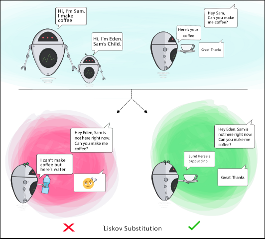

# SOLID Principles
## Liskov Substitution Principle
> If **S** is a subtype of **T**, then objects of type **T** in a program may be replaced with objects of type **S** without altering any of the desirable properties of that program.

Here **subtyping** means **Inheritance**


* When a child Class cannot perform the same actions as its parent Class, this can cause bugs.
* If you have a Class and create another Class from it, it becomes a parent and the new Class becomes a child. The child Class should be able to do everything the parent Class can do. This process is called Inheritance.
* The child Class should be able to process the same requests and deliver the same result as the parent Class or it could deliver a result that is of the same type.

> The picture shows that the parent Class delivers Coffee(it could be any type of coffee). It is acceptable for the child Class to deliver Cappucino because it is a specific type of Coffee, but it is NOT acceptable to deliver Water.

***NOTE:- If the child Class doesn’t meet these requirements, it means the child Class is changed completely and violates this principle.***

## Let's take A Look n Code
### 1. Trait CoffeeMachine.scala
Make a trait so that we can overide is methods

```scala
trait CoffeeMachine {
  def serveCoffee(): Unit
}
```

### 2. BasicCoffeeMachine.scala
* BasicCoffeeMachine class extended with trait and defines it own method and override serveCoffee()
* In this way our subtype is replaced without disturbing desirable properties of program.


```scala
class BasicCoffeeMachine extends CoffeeMachine {
  val coffee="Powdered"

  override def serveCoffee(): Unit = {
    val cup = brewFilterCoffee(coffee)
    println("Here is your " + cup)
  }
  def brewFilterCoffee(coffee:String): String ={
    println("coffee is in " +coffee+" form")
    println("Brewing...")
    "Freshly brewed coffee"
  }
}
```
### 3. PremiumCoffeemachine.scala
* PremiumCoffeeMachine class extended with trait and defines it own method and override serveCoffee()

```scala
class PremiumCoffeeMachine extends CoffeeMachine {
  val coffee = "Beans"

  override def serveCoffee(): Unit = {
    val cup = brewFilterCoffee(coffee)
    println("Here is your "+cup)
  }

  def brewFilterCoffee(coffee:String): String ={
    println("coffee is in " +coffee+" form")
    println("Grinding beans")
    println("Brewing... Filtering...")
    "Freshly brewed premium Latte` coffee"
  }
}
```

## Goal
This principle aims to enforce consistency so that the parent Class or its child Class can be used in the same way without any errors.


